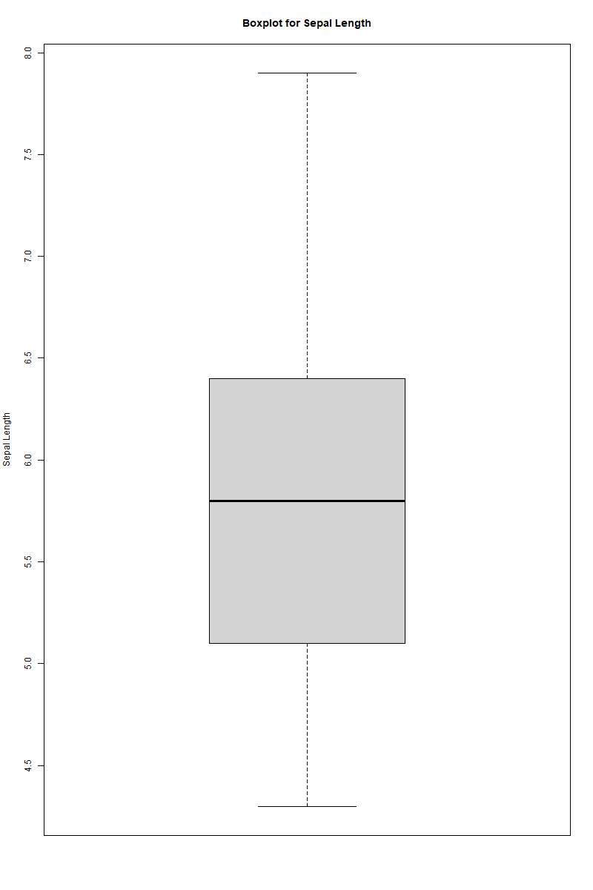

+++

title = 'Data Pre-processing with Iris Dataset'

date = 2024-11-24T03:03:29-05:00

draft = false

+++

## Introduction to Pre-Processing data in R with the Iris Dataset

Let's work with the built-in `iris` dataset, which contains data on 150 different species of iris flowers. Each entry contains the following measurements for the flowers:

- Sepal length
- Sepal width
- Petal length
- Petal width
- Species

We will break down the basic steps that make up loading, viewing, and cleaning up the dataset. At the end, we will see the benefit and importance of having a clean dataset, and how failing to adequately do so can cause issues with our analyses.

---

### Step 1: Load the required packages

In this lesson, we will be using the `datasets` and `ggplot2` packages for our code. Let's start!

```r

if (!require(datasets)) {
    # Install the 'datasets' package if it is not installed
    install.packages("datasets")
    # Load the 'datasets' package
    library(datasets)
}
if (!require(ggplot2)) {
    install.packages("ggplot2")
    library(ggplot2)
}

```

**Explanation:**

- `if (!require(datasets))` checks to see if the datasets package is installed. The same goes for the same statement checking to see if `ggplot2` is installed.
- `install.packages()` is used to install the corresponding package that is included within the parentheses.
- `library()` is used to load the methods or functions within the specified package for use within code. Without this command, we would not be able to use the methods contained in the package.

### Step 2: Load and Check Data

We are going to load in the dataset, and then check its structure and dimensions.

```r

data(iris)

# Display the first few rows of the dataset
cat("\nFirst few rows of the iris dataset:\n")
print(head(iris))

# Display the structure of the dataset
cat("\nStructure of the iris dataset:\n")
str(iris)

```

**Explanation:**

- `data(iris)` loads in the `iris` dataset.
  
- `head(iris)` displays the first few rows of the dataset.
  
- `str(iris)` displays the structure of the dataset, including the number of observations (`n`) and variables (`length`).

**Output:**

```r

First few rows of the iris dataset:

  Sepal.Length Sepal.Width Petal.Length Petal.Width Species
1          5.1         3.5          1.4         0.2  setosa
2          4.9         3.0          1.4         0.2  setosa
3          4.7         3.2          1.3         0.2  setosa
4          4.6         3.1          1.5         0.2  setosa
5          5.0         3.6          1.4         0.2  setosa
6          5.4         3.9          1.7         0.4  setosa

Structure of the iris dataset:

'data.frame':   150 obs. of  5 variables:
 $ Sepal.Length: num  5.1 4.9 4.7 4.6 5 5.4 4.6 5 4.4 4.9 ...
 $ Sepal.Width : num  3.5 3 3.2 3.1 3.6 3.9 3.4 3.4 2.9 3.1 ...
 $ Petal.Length: num  1.4 1.4 1.3 1.5 1.4 1.7 1.4 1.5 1.4 1.5 ...
 $ Petal.Width : num  0.2 0.2 0.2 0.2 0.2 0.4 0.3 0.2 0.2 0.1 ...
 $ Species     : Factor w/ 3 levels "setosa","versicolor",..: 1 1 1 1 1 1 1 1 1 1 ...

```

### Step 3: Checking the data

Now that we've got the dataset loaded, and can draw some basic information from it, let's make sure there's no missing or irregular values.

```r

cat("\nChecking for NA values in the dataset:\n")
print(any(is.na(iris)))

cat("\nChecking for duplicate rows in the dataset:\n")
print(any(duplicated(iris)))

cat("\nBoxplot for Sepal.Length to check for outliers:\n")
boxplot(iris$Sepal.Length, main="Boxplot for Sepal Length", ylab="Sepal Length")

cat("\nLevels of the Species factor:\n")
print(levels(iris$Species))

cat("\nChecking for zero or negative values in Sepal.Length:\n")
print(any(iris$Sepal.Length <= 0))

```

**Explanation:**

-`is.na()` checks to see if any of the values within the dataset are missing. The use of `any()` serves as a wrapper to see if any of the values are missing, rather than for a specific value.

- `duplicated()` checks to see if any of the rows within the dataset are duplicated.

- `boxplot()` creates a boxplot of the `Sepal.Length` variable within the dataset given the argument of `iris$Sepal.Length`.

- `levels()` returns the levels of the `Species` factor within the dataset given the argument of `iris$Species`.

- `any(iris$Sepal.Length <= 0)` to see if any of the values within the `Sepal.Length` variable are zero or negative.

**Output:**

```r

Checking for NA values in the dataset:
[1] FALSE

Checking for duplicate rows in the dataset:
[1] TRUE

Boxplot for Sepal.Length to check for outliers:
[Bloxplot image is attached below]

Levels of the Species factor:
[1] "setosa"     "versicolor" "virginica"

Checking for zero or negative values in Sepal.Length:
[1] FALSE

```



---

### Step 4: Cleaning the data

In this step, we'll take a look at some of the data cleaning techniques that you can use in R to prepare the data for analysis. We already know from the previous step that there is a duplicate row in the dataset, so let's remove it. Let's also check the dataset after it has been cleaned to make sure that the duplicate row has been removed, and there's no missing values beyond the one we removed.

```r

print("\nRemoving duplicate rows from the dataset:\n")
iris <- iris[-which(duplicated(iris)),]

str(iris)

```

**Explanation:**

- `which(duplicated(iris))` returns the indices of the duplicate rows within the dataset.
- `iris[-which(duplicated(iris)),]` removes the duplicate rows from the dataset.
- `str(iris)` prints the structure of the cleaned dataset, as we had done in step 2.

**Output:**

```r

Removing duplicate rows from the dataset:

[1] FALSE

'data.frame':   149 obs. of  5 variables:
 $ Sepal.Length: num  5.1 4.9 4.7 4.6 5 5.4 4.6 5 4.4 4.9 ...
 $ Sepal.Width : num  3.5 3 3.2 3.1 3.6 3.9 3.4 3.4 2.9 3.1 ...
 $ Petal.Length: num  1.4 1.4 1.3 1.5 1.4 1.7 1.4 1.5 1.4 1.5 ...
 $ Petal.Width : num  0.2 0.2 0.2 0.2 0.2 0.4 0.3 0.2 0.2 0.1 ...
 $ Species     : Factor w/ 3 levels "setosa","versicolor",..: 1 1 1 1 1 1 1 1 1 1 ...

```

#### Results of cleaning the data

As you can see, in comparison to the `str(iris)` in step 2, once we've removed the duplicate row, there now are 149 observations instead of 150, and there are now no outliers or other abnormal values. Now the data is ready for analysis!

### Step 5: Conclusion

In this lesson, we've gone through the basics of loading and exploring the `iris` dataset in R. We've also seen how to check for missing values, outliers, and duplicate rows in the dataset.
We've also seen how to remove duplicate rows from the dataset, and how to use `ggplot2` to create visualizations of the data. It is an important practice to check your data once you've found a source that you're comfortable with, and that you feel is reliable and accurate. Even small abnormalities within data can cause issues with your analyses, and might be hidden until you visualize the data and come across them. Being sure to check your data through visualizations and pre-processing is an important part of ensuring that your analyses are accurate and reliable.

Good work, you've learned the basics of data pre-processing in R!

---

### What's Next?

- You can try modifying the plots to explore other variables or try additional visualizations like histograms, density plots, or heatmaps.
- Experiment with different `ggplot2` functions for more advanced visualizations.
- Try out graphing specific attributes of the dataset, or create your own visualizations to illustrate interactions between variables.
